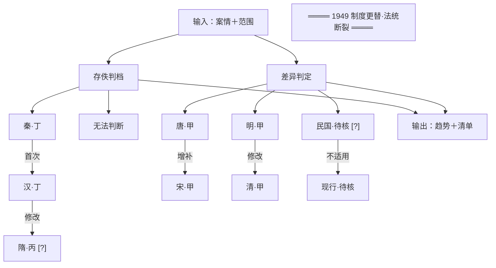

# 示范报告 · 亲属相告（告尊长）的法律地位

> **问题**：子女（卑幼）控告父母（尊长），历代法律如何规定？现行法立场为何？
> **示范目的**：演示本技能六段式契约、存佚判档、差异五态与不确定性标注的实际用法。
> **生成日期**：2026-10-04 ｜ 现行法核验日期：**2026-10-04**

---

## 【一】比较问题范围与判断标准

### 1.1 案情事实

〔假设案情〕某甲之子孙某乙，持有其父某丙生前受损之事，赴县衙控告某丁（尊长）。问：乙的告诉是否受理？若受理而构成虚妄，乙与丁各担何责？

> 本案情为**构造案例**，非真实个案。选取理由：此问题在底座中有条文级证据（六朝齐备），能完整演示各朝差异。

### 1.2 涉及法律部门

**刑律·告诉身份限制**（主）× 诉讼程序（受理与否）× 诬告反坐（附带）

### 1.3 判断口径（跨朝不可直接对齐）

| 朝段 | 口径 | 归责结构 |
|---|---|---|
| 秦汉 | 律令"勿听" | **程序性排除**——告诉不受理，不进入实体刑 |
| 唐宋 | 律"坐"某刑 | **实体刑**——告诉本身构成犯罪 |
| 明清 | 律定罪、例可改 | **实体刑**，律文稳定而附例增修 |
| 民国 | 继受法 | 〔本次未能核验〕 |
| 现行 | 违法＋责任分离 | 诬告陷害罪（构成要件式）；亲属关系**不构成免责事由** |

> ⚠ **三者不可直接换算**：唐之"绞"是告诉行为直接构成犯罪；现行"诬告陷害罪"要求"捏造事实＋意图使他人受刑事追究＋情节严重"。**"古法允许告尊长"与"现行法禁止告父母"是错误对读**——古代禁的是"告诉"本身，现代禁的是"诬告"。

### 1.4 各节点可判断度（存佚判档）

| 节点 | 可判断度 | 主要法源 | 本次检索范围 | 结论强度上限 |
|---|---|---|---|---|
| 秦 | **丁·简号级** | 睡虎地《法律答问》 | 该书公开释文 | 限该批材料 |
| 汉 | **丁·简号级** | 张家山《二年律令·告律》简126–131 | 该简号 | 限该批简牍 |
| 隋 | **丙·仅程序级** | 《隋书》卷25《刑法志》 | 史志篇目与程序 | **仅程序级** |
| 唐 | **甲·条文级** | 《唐律疏议》卷24·斗讼 | 卷24斗讼门 | 条文级 |
| 宋 | **甲·条文级** | 《宋刑统》卷24·斗讼 | 卷24斗讼门 | 条文级 |
| 元 | **乙·门类级** | 《元典章》卷53·刑部 | 卷53诉讼门 | **门类级** |
| 明 | **甲·条文级** | 《大明律》卷22·刑律·诉讼 | 卷22全门 | 条文级 |
| 清 | **甲（律）** | 《大清律例》卷30·刑律·诉讼 | 卷30第337条 | 条文级 |
| 民国 | 待核 | — | **本次未核验** | 〔未能核验〕 |
| 现行 | 待核 | flk.npc.gov.cn 等官方源 | 已核验部分见 1.5 | 条文级＋时效性 |

### 1.5 现行法核验结果（核验日期 2026-10-04）

| 项 | 核验结果 | 来源 |
|---|---|---|
| 诬告陷害罪 | **《刑法》第243条**：捏造事实诬告陷害他人，意图使他人受刑事追究，情节严重的，处三年以下有期徒刑、拘役或者管制；造成严重后果的，处三年以上十年以下有期徒刑。**"不是有意诬陷，而是错告，或者检举失实的，不适用前两款的规定。"** | 官方文本（地方政府转载全文）；**建议回 flk.npc.gov.cn 复核时效性** |
| 关键发现 | **现行法中不存在"亲属相告免罪"或"容隐"条款。**尊长身份**不构成**告诉阻却事由；亲属间的告诉若属错告不构成犯罪，若属故意捏造则依第243条论处 | 同上 |
| 其他相关 | 第245条非法搜查罪／非法侵入住宅罪；第246条侮辱罪、诽谤罪 | 同上 |
| 〔待核〕 | 《治安管理处罚法》相关罚则**版本待核**——检索显示该法于 2025-06-27 有新条目，处罚幅度可能已变 | 须回官方源确认现行版本 |
| 〔未能核验〕 | 民法典亲属编的具体条号与"名誉权"条文本次未逐条核验 | — |

> **重要更正记录**：本报告起草时曾误记"诬告陷害罪为《刑法》第246条"。经在线核验，**第246条实为侮辱罪、诽谤罪**，诬告陷害罪在**第243条**。此即本技能铁律 10"不凭记忆断言时效性与条号"的实例。

---

## 【二】时间轴比较表

| 朝代 | 年份 | 法源（文献·卷次门条） | 条文要点 | 证据层级 | 差异态 | 差异依据 |
|---|---|---|---|---|---|---|
| **秦** | 约秦王政年间 | 《睡虎地秦简·法律答问》非公室告条（简号诸说不一，**待核**） | "子告父母，臣妾告主，非公室告，勿听。" | **A**（秦简整理本） | 首次 | 该批简牍未见此前禁止规定；秦为现存最早禁止记载 |
| **汉** | 汉初（《二年律令》编纂期） | 张家山《二年律令·告律》简126–131（**篇目归属有争议**） | "子告父母，妇告威公，奴婢告主、主父母妻子，勿听而弃告者市。" | **A**（简号级，篇目争议） | **修改** | 承秦"勿听"而**增列**妇告威公、奴婢告主；罚则由"勿听"升为**"弃告者市"**——即告诉人本人处死并弃市 |
| **隋** | 开皇年间 | 《隋书》卷25《刑法志》（《开皇律》全佚） | 〔该朝律文已佚，无法判断身份禁告的规定〕；仅存"八曰斗讼"篇目与逐级申诉程序 | **B** | **无法判断** | 《开皇律》正文不存，无从判断；**不作废止论，亦不作沿用论** |
| **唐** | 律成于永徽、疏议颁于开皇 | 《唐律疏议》卷24·斗讼·**总第345条** | "诸告祖父母、父母者，绞。谓非缘坐之罪及谋叛以上而故告者。" | **A**（律典） | **修改（实质转向）** | 由汉之**程序性排除**转为**实体刑"绞"**——告诉本身构成犯罪，罚则极重 |
| **唐** | 同上 | 同上·**总第346条** | "诸告期亲尊长、外祖父母、夫、夫之祖父母，虽得实，徒二年……告大功尊长各减一等；小功、缌麻减二等。" | **A** | 增补 | 按五服亲疏分档处刑，**构成精细化的身份梯度** |
| **宋** | 雍熙年间编成 | 《宋刑统》卷24·斗讼门"告祖父母父母" | 承唐制，"告祖父母、父母者，绞" | **A** | **沿用（全沿）** | 《宋刑统》承唐律原文，文字与罚则均同；**法统内承继关系可证** |
| **元** | 大德前后 | 《元典章》卷53·刑部·诉讼门 | 〔该门未见身份禁告相应规定〕 | **B**（政书，非律典） | **无法判断** | 《大元通制》整体散佚；《元典章》该门未见相应规定，**该批材料未见，不作废止论** |
| **明** | 洪武三十年定本 | 《大明律》卷22·刑律·诉讼·**第6条·干名犯义** | "凡子孙告祖父母、父母，妻、妾告夫及夫之祖父母、父母者，杖一百，徒三年。但诬告者，绞。"并列明例外情形（谋反大逆、谋叛、窝藏奸细、嫡母继母慈母生母被杀、被期亲以下尊长侵夺财产或殴伤等，"并听告"） | **A** | **修改（罚则大幅缓和）** | 由唐之**绞**降为**杖一百徒三年**；但**诬告者仍绞**；并新增"听告"例外清单 |
| **清** | 律文乾隆五年定型 | 《大清律例》卷30·刑律·诉讼·**第337条·干名犯义** | "凡子孙告祖父母、父母，妻妾告夫及告夫之祖父母、父母者，虽得实，亦杖一百、徒三年。"（诬告者绞；附例3条） | **A（律）** | **沿用（全沿）** | 律文承明制，文字与罚则均同；**附例3条年份待核，本次未能判断其增删** |
| **——** | **1949** | **制度更替·法统断裂** | **1949年后为另一法统，不适用差异五态** | — | — | 见 `06_断点与近代段.md` |
| **民国** | 〔未核验〕 | 民国《民法·亲属编》等 | 〔本次未能核验原文及施行日期〕 | — | **不适用** | 属1949年后法统，与前列条文**无承继关系**；本次**未能核验** |
| **现行** | 核验日期 2026-10-04 | 《中华人民共和国刑法》**第243条**（诬告陷害罪） | 捏造事实诬告陷害他人，意图使他人受刑事追究，情节严重的，处三年以下有期徒刑、拘役或者管制；造成严重后果的，处三年以上十年以下有期徒刑。**错告或检举失实的不适用前两款** | **A**（官方文本；时效性**建议回 flk.npc.gov.cn 复核**） | **不适用** | 属1949年后法统，**无承继关系**；现代采"违法＋责任分离"，尊长身份不构成告诉阻却事由 |

> **表中未出现"废止"一态**——因为本问题在秦至清的八朝之间，**没有一条规范被正面依据证明为废止**。唐之"绞"至明被"杖徒"取代，属**修改**而非废止（律条本身并未被删除，而是改换内容）。元代未见，属**材料未见**，不写废止。

---

## 【三】规范状态谱系图

```
                    [输入：案情＋范围]
                           │
                    [存佚判档] │ [差异判定]
                           │
  秦·丁 ──(首次)──→ 汉·丁 ──(修改)──→ 隋·丙 [?]
                           │
                      [无法判断]
                           │
  唐·甲 ──(增补)──→ 宋·甲        明·甲 ──(修改)──→ 清·甲

                 ════ 1949 制度更替·法统断裂 ════

                       民国·待核 [?] ──(不适用)──→ 现行·待核
                       │
                  [输出：趋势＋清单]
```

> **载体：T1 纯文本框线图**（节点 11，未超框线图上限 12）。
> 1949 断点**单独成行且不与任何节点连线**——跨断点连一条线，等于宣称法统承继，那是历史伪造。校验码 `BREAK_NOT_ISOLATED`。

**图说：** 这张图画的是同一个法律问题在十个朝代之间的规范关系，不是法条原文的排列。主线是秦汉程序排除、唐宋入罪、明清缓和三段，1949 年断开为两段，后段另起法统。标问号的三处是不确定处，材料不足不等于当时没有规定。

> **读图提醒**：节点宽度按显示宽度计（中文占 2 格），故每个节点只放一个概念——"秦·丁"读作"秦代，可判断度丁档"。箭头的括号里是差异态，不是评价。
> **若节点增至 13 个以上**，须按 `11_线框图规范.md` 第二节降级为 Mermaid（≤24）或 inline SVG，并另附等价 Mermaid 作为机检基准。

### 附：等价 Mermaid 源码（供需要渲染图形的读者）



---

## 【四】趋势与转折点

### 转折点 1：汉——从"勿听"到"弃告者市"

- **条文证据**：秦《法律答问》"非公室告，勿听"；汉《告律》简126"勿听而弃告者市"【A】
- **典制证据**：汉代告律另立"告不审""诬告反坐"制度，《具律》规定"治狱者各以其告劾治之"【A】
- **动因**：**未及考**。现有文献未见汉廷对身份禁告加重刑罚的立法理由说明
- **表述强度**：**转折点**（条文＋典制双证据）

### 转折点 2：唐——从程序性排除转为实体刑（本问题最关键的一变）

- **条文证据**：《唐律疏议》卷24·斗讼总第345条"诸告祖父母、父母者，绞"【A】，与汉"勿听"性质不同——**告诉本身即构成犯罪**
- **典制证据**：唐律首开**五服亲疏分档**（总第346条期亲尊长徒二年、大功以下各减等），形成身份梯度体系【A】
- **实践证据**：〔本次未及检索唐代司法档案，无案例佐证〕
- **动因**：**通行解释认为**与唐代礼法体系、尊卑秩序的强化有关，**但未及核验原始文献**，列入【五】
- **表述强度**：**转折点**（条文＋典制双证据）；**动因为单证据偏弱**

### 转折点 3：明——从绞降为杖徒，但诬告仍绞

- **条文证据**：《大明律》卷22·刑律·诉讼第6条"杖一百，徒三年。但诬告者，绞"【A】
- **典制证据**：明律另立"听告"例外清单（谋反大逆、尊长侵夺财产或殴伤等）【A】
- **实践证据**：黄岩诉讼档案（同治—光绪，**属清代地方层级，不外推至明**）【A·档案】
- **动因**：有立法理由文献可引？**未及核验**；〔待核〕可查《大明律·附疏》或《问刑条例》相关奏疏
- **表述强度**：**转折点**（条文＋典制双证据）

### 趋势：一个非单调的曲线（须如实说明）

初稿曾预设"历代逐渐放宽"的直线叙事。**逐条核对后发现该叙事不成立**：

```
秦  勿听（程序排除）
汉  勿听 + 弃告者市（程序排除，但告诉人反坐致死）← 加重
唐  绞（实体刑）                          ← 最严
宋  绞（承唐）
元  无法判断（材料未见）
明  杖一百徒三年（诬告绞）                ← 缓和
清  同明
——1949 断裂——
现行  须捏造事实且情节严重方构成诬告陷害罪；尊长身份不阻却告诉
```

**真正的走势是"排除—加重—实体化—缓和—重构"，不是单调放宽。** 且现行法的变化**不是古代"容隐条款被删除"**——本次未检得"亲亲相隐"的正面废止依据，且1949年属法统替换，不适用差异五态。

> **这条自我更正正是本技能第 5 号纪律的实践**：趋势必须从节点里长出来；先定趋势再找节点，会在史料不合时仍去找"合的"。

---

## 【五】明文规定 / 实际执行 / 学理解释

### 5.1 三重语域并置

同一问题在不同时代的三种说法，**各占区块，不混排**：

**【文言原文】**
> 「诸告祖父母、父母者，绞。谓非缘坐之罪及谋叛以上而故告者。」——《唐律疏议》卷24·斗讼·总345条

**【白话译文】**
> 控告祖父母、父母的，处绞刑。谓：非因缘坐而得的罪，也不是谋叛以上故意诬告的情形。——《唐律疏议》卷24

**【现行法】**
> 《中华人民共和国刑法》第243条：捏造事实诬告陷害他人，意图使他人受刑事追究，情节严重的，处三年以下有期徒刑、拘役或者管制。**不是有意诬陷，而是错告，或者检举失实的，不适用前两款的规定。**（核验日期 2026-10-04）

> 三行并置，读者一眼看清"同一问题在不同时代怎么说"。**文言原文不改一字，白话不合并段落，现行法用现代术语。**

### 5.2 三层效力分层

| 层 | 内容 | 出处与效力 |
|---|---|---|
| **明文规定（秦）** | 《法律答问》："子告父母，臣妾告主，非公室告，勿听" | 【A·秦简】 |
| **明文规定（汉）** | 《二年律令》告律简126："子告父母……勿听而弃告者市" | 【A】 |
| **法定解释（唐）** | 疏议对该条射程的说明，**有法律效力**，与私人注疏不同 | 《唐律疏议》疏议【A·法定解释】 |
| **明文规定（明/清）** | 《大明律》卷22·6、《大清律例》卷30·337："杖一百，徒三年。但诬告者，绞" | 【A】 |
| **实际执行（清·地方）** | 徽州休宁《词讼条约》："将远年旧事及已经审结之案希图翻控者，不准"（**属受理环节裁断，非律条本身**） | 徽州档案【A·档案·地方层级，不可外推】 |
| **学理解释** | 后世律学家对"干名犯义"射程与唐明罚则落差之讨论 | 【B/C】**无法律效力** |
| **明文规定（现行）** | 《刑法》第243条诬告陷害罪 | 官方文本【A】 |
| **明文规定（现行·待核）** | 《治安管理处罚法》相关罚则 | **版本待核**（2025-06-27 有新条目） |
| **〔未及核验〕** | 民法典亲属编具体条号 | 本次未逐条核验 |

### 5.3 层间冲突提示

- **唐之"绞"与明之"杖徒"不可混读**：唐是告诉即构成犯罪，明是告诉构成犯罪但刑罚减轻。二者性质相同、幅度不同。
- **现行"错告不适用"与汉"弃告者市"不可对读**：汉以告诉人弃市为后果，不区分故意与过失；现行明确"错告或检举失实的不适用"。**这是责任结构的实质差异**，比罚则轻重更值得注意。

---

## 【六】不确定性清单

| # | 不确定项 | 性质 | 影响 |
|---|---|---|---|
| 1 | **隋代身份禁告的规定** | 《开皇律》全佚，仅存篇目 | 唐之前该条的形成路径**无法判断**；不得写"隋代无此规定" |
| 2 | **元代身份禁告的规定** | 《大元通制》散佚；《元典章》卷53该门未见 | **不作废止论**——元代是否另有规定，无从判断 |
| 3 | **秦简"非公室告"条的简号** | 诸说不一，底座标**待核** | 引用时须带"简号待核"，不得指定具体简号 |
| 4 | **《告律》篇目归属** | 学界有争议（告律／具律） | 引用时须标"篇目归属有争议" |
| 5 | **唐之"容隐"相关规定条号** | 本次**未及核验**具体条号 | 不得据记忆填写条号；本报告因此**未在表中列入容隐条文** |
| 6 | **唐→明罚则缓和的立法理由** | 未及核验原始文献 | 【三】中"通行解释认为"的动因表述**仅为学界通行说法，非文献结论** |
| 7 | **明代"听告"例外的完整清单** | 本次仅引《大明律》条文所附，**未穷尽**《问刑条例》等后续附例 | 明代例外范围可能宽于本表所示 |
| 8 | **清第337条附例3条的年份与内容** | 年份待核 | **无法判断该附例是否被后例修改或废止**；故本表清节点只以律文立论 |
| 9 | **民国段全部内容** | 本次**未能核验** | 民国《民法·亲属编》是否保留尊卑差别、是否另设容隐，**本报告无任何断言** |
| 10 | **现行法时效性** | 核验日期 2026-10-04，但**未逐条回 flk.npc.gov.cn 读取"时效性"字段** | 建议复核；本报告的现行段**未用于任何实际法律判断** |
| 11 | **《治安管理处罚法》现行版本** | 2025-06-27 有新条目，处罚幅度可能已变 | **版本待核**，本报告不引用其具体罚则 |
| 12 | **本次核验范围** | 底座仅覆盖诉讼/词讼类；本问题正落在该范围内，故实体法缺口**未对本报告构成障碍** | 若问题扩展至田土、继承等，则须走在线补录并另标未入底座 |
| 13 | **唐代司法实践证据** | 未及检索 | 转折点 2 缺"实践证据"一类，故动因表述强度偏弱 |

---

## 【七】总结：从法律变迁角度的脉络与现行取向

**秦至清构成一条法统内部的演进线索，但它的形状不是直线**：

这条线索的起点是**程序性排除**——秦人把"子告父母"归入"非公室告"，不受理即可了事。汉人加重了一步：告诉虽不受理，但告诉人本身"弃告者市"，即**告诉行为本身要被处死**。这是一个从"程序屏障"到"实体威慑"的关键转换。

**唐宋把这一威慑推到了顶点**：告诉尊长不再是"不被受理"，而是**"绞"**——告诉行为直接构成犯罪，且几乎无从宽免（只有谋反以上等极端情形在例外之列）。同时唐律建立了**五服亲疏的分档处刑**，把亲属关系细密地转换成刑罚梯度。

**明清则大幅缓和**：子孙告祖父母父母由"绞"减为"杖一百、徒三年"，妻妾告夫同例；但**保留了一个高压阀门——"诬告者，绞"**。也就是说，明清律区分了"确有的告诉"（轻）与"虚假的告诉"（重），而唐律在此问题上是**一刀切**的。这是一次**责任精细化**的改革，而不是单纯放宽。

**元代这一环无法判断**——这是本报告最诚实的一处留白。《大元通制》散佚，《元典章》该门未见规定，我们既不能说元代废除了此制，也不能说它承袭了唐制。**材料的沉默必须原样保留。**

**1949 年是一条不能跨越的线**。此后的规范不与上述任何一朝构成承继关系：清律的"干名犯义"与今天的法律不是"旧条被改"的关系，而是**法统替换**。因此正确的写法是"断裂与重建"，而不是"从重到轻的演进"。

**现行取向**：现行法**不设"亲属相告免罪"或"容隐"条款**。尊长身份**不构成**告诉阻却事由；子女控告父母，就告诉行为本身而言不违法。真正的法律评价落在别处——若告诉**捏造事实**、意图使他人受刑事追究且情节严重，依《刑法》第243条诬告陷害罪论处；若属**错告或检举失实**，则不适用该款。**尊卑秩序在现行法中不再通过"禁止告诉"来维持，而是通过亲属关系本身的民事效力（赡养义务、继承顺位、家庭财产制）来体现。**

这条从"禁止告诉"到"评价告诉内容"的位移，是两千余年间本问题上最根本的一次转向：**从身份关系的准入控制，转向行为的个别评价。**

---

*本报告为方法示范。其中现行法段未经完整时效性核验，不得用于实际法律判断。*
