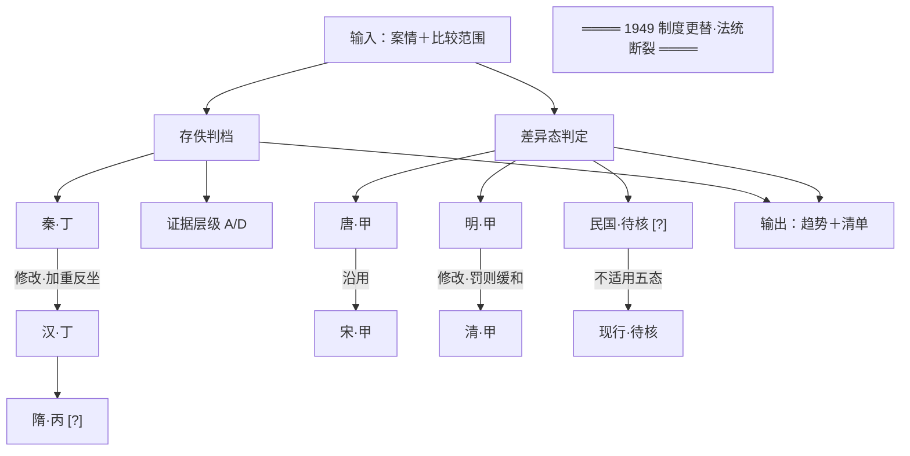

# 11 · 谱系图规范（载体分档）

> 目标：**画一张结构清晰的图，重点展示各部分之间的关系，而不是把原文塞进方框。**
>
> 载体：**默认纯文本框线图**（零依赖）；节点增多时**降级为 Mermaid 或 SVG**。
> **换载体不换纪律**——三种载体的节点单概念、关系须有出处、不确定须标注、图说三句，一律同标准。

---

## 一、这张图是什么，不是什么

| 是 | 不是 |
|---|---|
| **图谱**（管关系） | **脑图**（管层级） |
| 节点＝朝代，箭头＝差异态 | 把条文原文塞进方框 |
| 标出输入与输出边界 | 画成"漂亮但关系错"的示意图 |
| 不确定处单独标注 | 为美观补一条原文没有的箭头 |

> **依据**：工作区约定「**脑图管层级、图谱管关系**」。
> 十节点的**层级**已由【二】比较表承担；本图**只负责关系**（沿用／修改／增补／无法判断／断裂）。两者分工不重叠。

---

## 二、载体三档（规模决定载体，不决定图型）

**图型恒为「规范状态谱系图」；变的只是画法。** 不要因为换载体就改画什么。

| 载体 | 适用规模 | 机器件字段 | 机检方式 |
|---|---|---|---|
| **T1 纯文本框线图** | 节点 **≤ 12**（默认） | `diagram.carrier="ascii"` | 直接解析 `[节点]`／`──(关系)──→` |
| **T2 Mermaid** | 节点 **13–24**，或需要分组/方向控制 | `diagram.carrier="mermaid"` | 解析 `ID["标签"]`／`A -->\|关系\| B` |
| **T3 inline SVG** | 节点 **> 24**，或需演示级成品 | `diagram.carrier="svg"` ＋ **必须附 T2 Mermaid 基准** | **只校验 Mermaid 基准**；SVG 本体只查存在性与图说 |

### 降级阶梯（按此顺序往下走，不得跳档）

```
节点 ≤ 12  → T1 框线图（零依赖，默认）
    > 12   → T2 Mermaid（可被任何 Markdown 渲染器出图，仍是纯文本）
    > 24   → T3 SVG（演示级）；若 SVG 与报告不同步，以 Mermaid 基准为准
```

### 三条硬纪律

| # | 纪律 | Why |
|---|---|---|
| 1 | **SVG 必须附一份等价 Mermaid 作为机检基准**（字段 `diagram.baseline`） | 否则四项图示校验在 SVG 上**全部失效**——扫描面之外等于没检查（`validator-harness` 技法九） |
| 2 | **换载体不换纪律**：节点宽度上限、关系须有出处、不确定须标 `[?]`、图说三句，在三档上一致 | 载体是呈现层，纪律是内容层。降级不得成为绕过校验的路径 |
| 3 | **降级须在【三】注明**：`载体：Mermaid（节点 16，超框线图上限 12）` | 读者有权知道看到的是哪种图；不注明＝让读者误以为看到了全部 |

---

## 三、标记约定（可机检）

### T1 框线图

图以 fenced code block 承载：

```
[节点名] ──(关系词)──→ [节点名]  [?]
```

| 元素 | 标记 | 机检用途 |
|---|---|---|
| 节点 | `[方括号]` 包裹 | 抽取节点序列 |
| 箭头 | `──→` | 抽取关系序列 |
| 关系词 | 箭头括号内 `(...)` | **须在报告正文／差异依据中有对应** |
| 存疑 | 节点或关系后加 `[?]` | 计数，且须图说提及 |
| 断点 | 单独一行 `════ 1949 制度更替 ════`，**不与任何节点连线** | 断点须显式出现且孤立 |
| 图说 | 以 `图说：` 开头的**恰好三句** | 句数机检 |

### T2 Mermaid



| 元素 | T2 写法 | 机检用途 |
|---|---|---|
| 节点 | `ID["标签"]`（**标签须加双引号**，`[?]` 才能安全嵌入） | 抽取标签文本 |
| 关系 | `A -->\|"关系词"\| B` 或 `A -- "关系词" --> B` | 关系词须有出处 |
| 存疑 | 标签内嵌 `[?]`，如 `SUI["隋·丙 [?]"]` | 计数 |
| 断点 | **孤立节点**，不写任何入边出边 | 断点须孤立 |
| 禁写 | ~~`subgraph` 承载朝代分组~~ | 分组会让"跨断点连线"难以目视阻断，且机检不覆盖分组嵌套——本档**禁用 subgraph** |

### T3 SVG

- **inline SVG**（`<svg>` 片段），随 Markdown 内联；不产出独立 `.svg` 文件（除非用户明确要）。
- 每个节点必须有 `<text>` 承载标签（供读屏与机检）；不得用纯图形表达概念。
- 节点标签、关系注记、`[?]` 标记，**内容与 Mermaid 基准逐字一致**——不一致即返工。
- **1949 断点在 SVG 中同样不得有连接线。**
- 颜色/字号/间距属审美，**不承载语义**：判档、不确定、差异态必须同时有文字标记，不得只靠颜色区分（色盲可读性＋打印黑白可读性）。

---

## 四、⚠ 技术陷阱：框线必须按**显示宽度**计算，不能按字符数

**仅 T1 适用**（T2/T3 由渲染器排版，不受此限）。**中文在等宽字体下占 2 个显示宽度。** 按 `len(str)` 画框线必然错位。

```python
def disp_width(s):
    """显示宽度：CJK 与全角标点计 2，ASCII 计 1。画框线必须用这个，不能用 len()。"""
    w = 0
    for ch in str(s or ""):
        w += 2 if unicodedata.east_asian_width(ch) in ("W", "F") else 1
    return w
```

- **节点标签上限：16 显示宽度**（约 8 个汉字）。超限即拆分节点。**此上限三档通用**——T2/T3 虽不受排版限制，但超长标签说明节点塞了多个概念，语义问题与载体无关。
- 这条是「节点单概念」的**物理保障**——节点装不下长句，自然被迫拆开。
- 本条须同步沉淀进 `~/.workbuddy/skills/validator-harness/`（CJK 显示宽度是通用陷阱，不止本技能）。

---

## 五、主图构造：「规范状态谱系图」

**构造顺序固定四步**（顺序错则图必错）：

1. **列节点**——按 S2 判档结果，一节点＝一朝代＋其可判断度（如 `秦·丁`）
2. **连关系**——按 S4 判定结果，箭头关系词＝差异态（沿用／修改／增补／无法判断／不适用）
3. **标不确定**——凡材料不足的节点一律加 `[?]`
4. **写图说**——恰好三句

### T1 骨架（10 节点，本技能默认形态）

```
                [输入：案情 + 比较范围]
                            │
          ┌─────────────────┴─────────────────┐
          │                                   │
     [可判断度判档]                       [差异态判定]
          │                                   │
  秦·丁 ──┐                          唐·甲 ──(沿用·全沿)──→ 宋·甲
  汉·丁 ──┴──(修改·加重反坐)──→ 隋·丙 [?]      │              │
          │                          │      元·乙 [?] ──(无法判断)──┘
   （证据层级 A/D）              [无法判断]              │
                                        │      明·甲 ──(修改·罚则缓和)──→ 清·甲
                                        │              │
                                        │      ════ 1949 制度更替·法统断裂 ════
                                        │                    │
                                        │            民国·待核 [?] ──(不适用五态)──→ 现行·待核
                                        │                    │
                                        ▼                    ▼
                          [无法判断：材料不存≠规定不存在]  [输出：趋势判断 + 不确定性清单]
```

### 三条硬性画法（三档通用）

| 要求 | 理由 |
|---|---|
| **1949 断点必须画成断链，不得连线** | 跨断点连一条线，等于宣称法统承继——那是历史伪造。T2 中表现为**孤立节点**，T3 中表现为**无连接线** |
| **不确定节点必须带 `[?]`** | 让读者一眼分清"确定的"与"不知道的" |
| **须标输入与输出边界** | 图是"怎么算出来的"的地图，不是结论本身 |

---

## 六、禁止事项

| ✗ 禁止 | Why |
|---|---|
| 把条文原文塞进方框／节点 | 用户原话。节点是概念，不是容器 |
| 一个节点塞多个概念 | 违反"每节点只保留一个核心概念" |
| 原文／报告未交代的关系自行补一条箭头 | **工作区红线：视觉类头号红线＝为美观补内容、补关系** |
| 省略箭头上的关系注记 | 无注记的箭头无法核验 |
| 不确定处不标 `[?]` 而混在确定项里 | 把无知伪装成确定 |
| 按字符数计算框线宽度 | 中文占 2 显示宽度，必然错位 |
| 图说凑数（如把一句话拆成三句） | 三句导读有信息量要求，不是句数游戏 |
| **节点 > 12 仍画框线图** | 密度过高必然错位。**降级是义务，不是选项**（校验码 `CARRIER_TOO_DENSE`） |
| **SVG 不附 Mermaid 基准** | 四项图示校验在 SVG 上全部失效，且无任何告警（校验码 `SVG_NO_BASELINE`） |
| **T2 中用 subgraph 分组朝代** | 分组会让跨断点连线难以目视阻断，且机检不覆盖嵌套 |
| **T3 中只靠颜色表达判档或不确定** | 色盲与黑白打印下语义丢失；语义必须有文字标记 |

---

## 七、图说什么（三句话的分工）

| 句 | 讲什么 |
|---|---|
| **第 1 句** | 这张图在画什么关系、节点代表什么 |
| **第 2 句** | 主流程怎么走、断点在哪 |
| **第 3 句** | 哪些地方是不确定的、为什么 |

**三句各有分工，不是同一句话说三遍。** 载体降级后**图说不得省略**——图说承载"该怎么读这张图"，是内容而非附属说明。

---

## 八、移交出口（本技能的边界）

本技能**可自出** T1／T2／T3 三种载体。当用户需要**超出图示本身**的产物时，移交下游：

| 移交对象 | 适用 |
|---|---|
| `archify` | 架构图／数据流／时序图，出 standalone HTML ＋ inline SVG |
| `legal-scenario-diagram` | 法律场景图（13 种类型 ＋ 17 种风格），默认 S0 极简克制黑白 |
| `drawio-diagram-generator` | 自然语言 → drawio 文件（需用户可二次编辑时） |

> **分工不变**：规范与语义归本技能，额外渲染形态归下游。移交时须把本文件的节点/关系/不确定标注约定与**载体档位**一并交代，否则图与报告会脱节。

---

## 九、机器件格式

```jsonc
"diagram": {
  "carrier": "ascii" | "mermaid" | "svg",   // 缺省按 ascii 校验
  "source":  "…图本体（T1/T2）…",
  "baseline":"…等价 Mermaid…",               // carrier=svg 时**必填**，否则阻断
  "gloss":   "…恰好三句图说…",
  "note":    "载体：Mermaid（节点 16，超框线图上限 12）"  // 降级时必填
}
```

> **`note` 是诚实性要求**：降级须让读者知道。缺 `note` 而降级，读者会把 Mermaid 当成"本技能的原生画法"，误判密度上限不存在。
